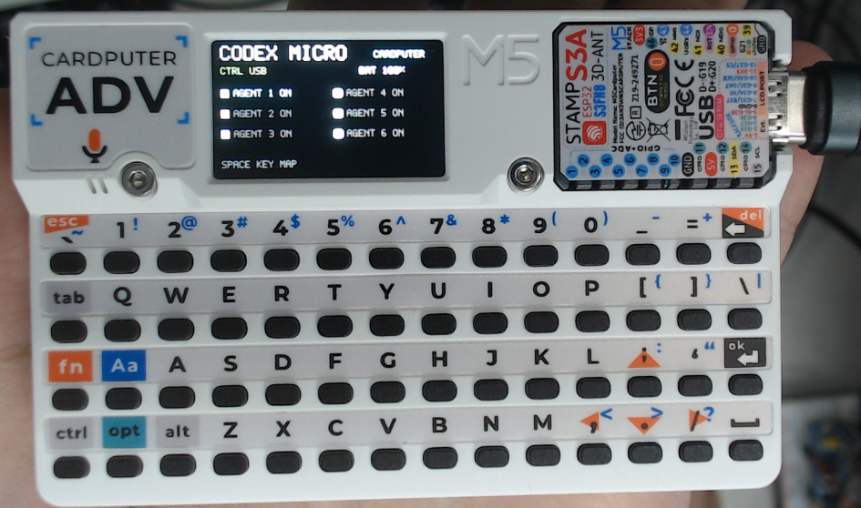
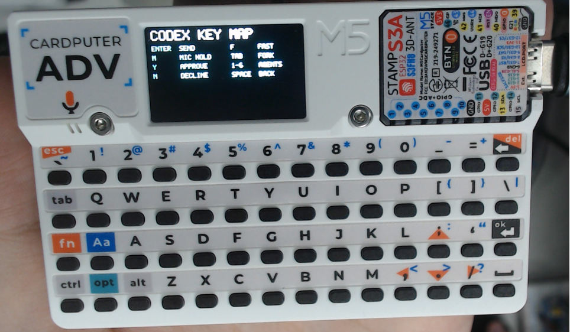

# Codex Micro (Cardputer)

[English](README.md) | 繁體中文

將 **M5Stack Cardputer ADV** 變成 Windows 11 的 Codex 控制器與 USB
麥克風。可使用 USB 或 BLE 傳送 Codex 按鍵；USB 連接時也能使用 Cardputer
內建麥克風，不需要安裝自訂驅動程式。

> 僅支援 Cardputer **ADV（StampS3A／ESP32-S3）**，不支援原版 Cardputer。

## 功能

- USB：Codex 按鍵控制＋Cardputer ADV 內建麥克風。
- BLE：Codex 按鍵控制，USB 無法使用時自動備援。
- LCD：連線方式、Agent 1～6 狀態、按鍵說明與平滑化電池百分比。
- 麥克風格式：單聲道、16 kHz、16-bit PCM。
- 不包含 speaker、錄音儲存、Wi-Fi 或音訊播放。

## 畫面預覽

| 主頁 | 操作說明 |
| :---: | :---: |
|  |  |

## 從 GitHub 下載並燒錄（Windows 11）

### 1. 安裝 ESP-IDF 5.5.2

使用 Espressif 官方的
[Windows 安裝說明](https://docs.espressif.com/projects/esp-idf/en/v5.5.2/esp32/get-started/index.html)，
安裝 **ESP-IDF v5.5.2**。安裝完成後，從開始選單開啟
`ESP-IDF 5.5 PowerShell`。

### 2. 下載專案

在 ESP-IDF PowerShell 執行：

```powershell
git clone https://github.com/zhao45/codex-micro-cardputer.git
cd codex-micro-cardputer
```

不使用 Git 也可以從 GitHub 點選 **Code → Download ZIP**，解壓縮後進入：

```powershell
cd "$HOME\Downloads\codex-micro-cardputer-main"
```

如果解壓縮位置不同，請改成實際資料夾路徑。

### 3. 編譯

```powershell
idf.py build
```

第一次編譯需要網路下載 ESP-IDF dependencies，完成後會產生：

```text
build/codex_micro_cardputer.bin
```

### 4. 讓 Cardputer 進入下載模式

1. 使用可傳輸資料的 USB 線連接 Cardputer ADV。
2. 按住 `G0`，再按一下 Reset；也可以按住 `G0` 時重新插入 USB。
3. Windows 出現新的 COM 後放開 `G0`。
4. 執行下列指令找出連接埠：

```powershell
Get-CimInstance Win32_SerialPort |
  Select-Object DeviceID,Name,PNPDeviceID
```

請找名稱類似 `USB Serial Device (COM9)` 的裝置。每台電腦的 COM 編號可能
不同。

### 5. 燒錄

將 `COM9` 換成剛才查到的連接埠：

```powershell
idf.py -p COM9 flash
```

看到 `Hash of data verified` 與 `Hard resetting via RTS pin` 表示燒錄成功。
燒錄後請放開 `G0`，按一下 Reset；若仍停在下載模式，拔掉 USB 後在**不按
G0** 的情況下重新插入。

韌體正常啟動後，燒錄用的 COM 可能消失，因為 USB 已切換成 Codex HID＋
麥克風複合裝置，這是正常現象。

## 連線與使用

| BLE | USB | 可用功能 |
|---|---|---|
| 有 | 有 | USB Codex 按鍵＋Cardputer 麥克風；BLE 備援 |
| 有 | 無 | BLE Codex 按鍵；使用 Windows／Codex 選擇的麥克風 |
| 無 | 有 | USB Codex 按鍵＋Cardputer 麥克風 |
| 無 | 無 | LCD 本機頁面與電池顯示 |

使用 BLE 時，在 Windows「設定 → 藍牙與裝置」配對 `Codex Micro`。使用內建
麥克風時，到「設定 → 系統 → 音效 → 輸入」選擇
`Cardputer ADV Microphone`。

USB 與 BLE 同時存在時會優先使用 USB；若 Codex 沒有接受 USB HID，BLE
仍會保持可用。同一個按鍵不會同時從 USB 與 BLE 重複送出。

## 按鍵

| Cardputer 按鍵 | Codex 動作 |
|---|---|
| Enter | Send |
| M（按住／放開） | Microphone press／release |
| Y | Approve |
| N | Decline |
| F | Fast |
| Tab | Fork |
| 1～6 | 選擇 Agent 1～6 |
| Space | 切換 LCD 本機頁面，不傳送給電腦 |

## 常見問題

### 找不到 COM

- 確認使用的是 USB 資料線，不是只能充電的線。
- 重新執行「按住 G0 → Reset／插入 USB」。
- 到 Windows 裝置管理員查看「連接埠（COM 和 LPT）」。

### 顯示 `Access denied` 或 COM 被占用

關閉其他 serial monitor、ESP-IDF monitor 或使用該 COM 的程式後再燒錄。

### 燒錄成功但畫面沒亮

裝置通常仍停在 G0 download mode。放開 `G0`，按 Reset，或不按 G0 重新插入
USB。

### Windows 找不到麥克風

重新插拔 USB，然後檢查「設定 → 系統 → 音效 → 輸入」。也可以執行：

```powershell
Get-PnpDevice -PresentOnly -Class AudioEndpoint |
  Where-Object FriendlyName -match 'Cardputer'
```

Windows／Codex 仍負責選擇實際使用的音訊輸入；韌體無法強制桌面程式切換
麥克風。

## 授權與來源

本專案是非官方相容性專案，與 OpenAI、Work Louder 或 M5Stack 無隸屬關係。
部分底層模組源自 MIT 授權的
[shenjingnan/agentmote](https://github.com/shenjingnan/agentmote)；USB Audio
元件源自 Espressif `esp-iot-solution` 並使用 Apache License 2.0。詳情請參閱
[LICENSE](LICENSE)、[NOTICE.md](NOTICE.md) 與元件內附的授權檔。
