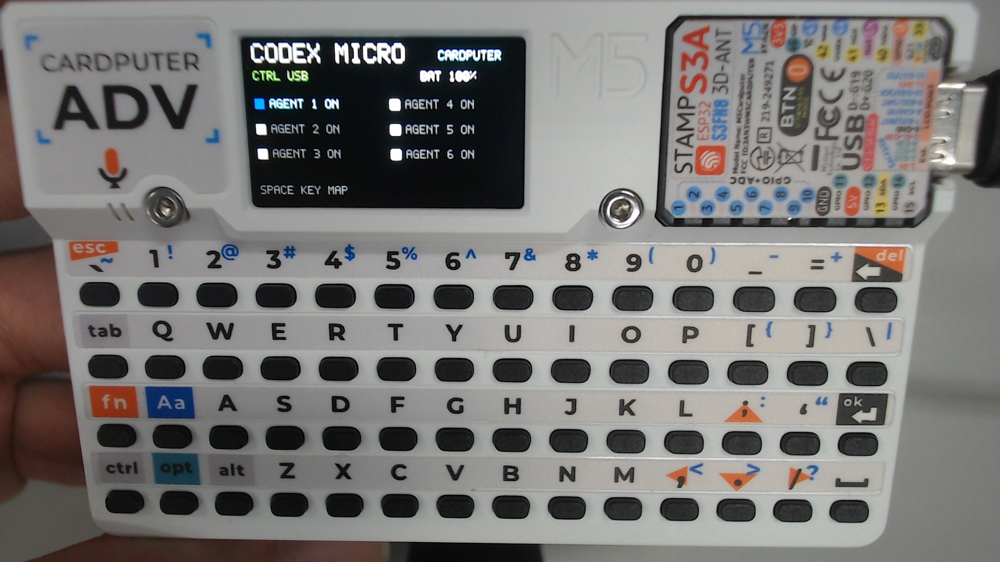
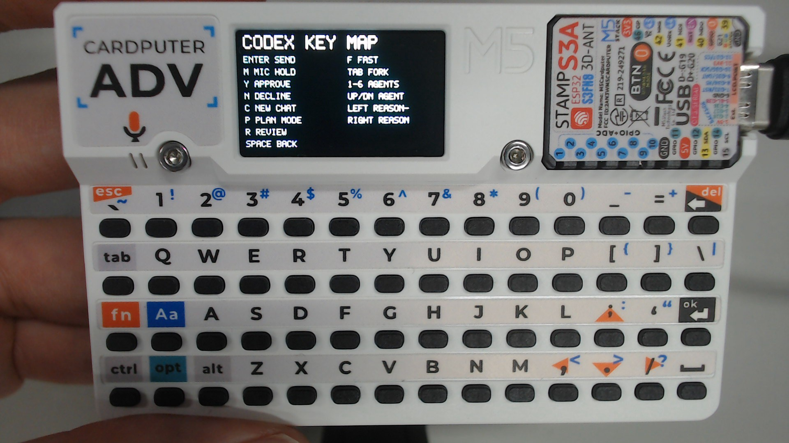
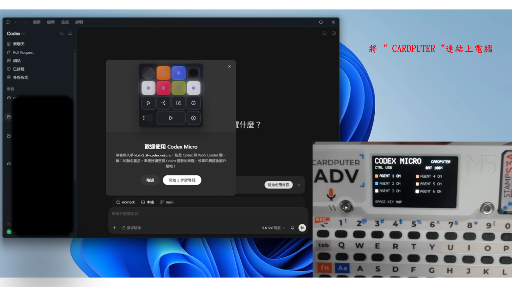
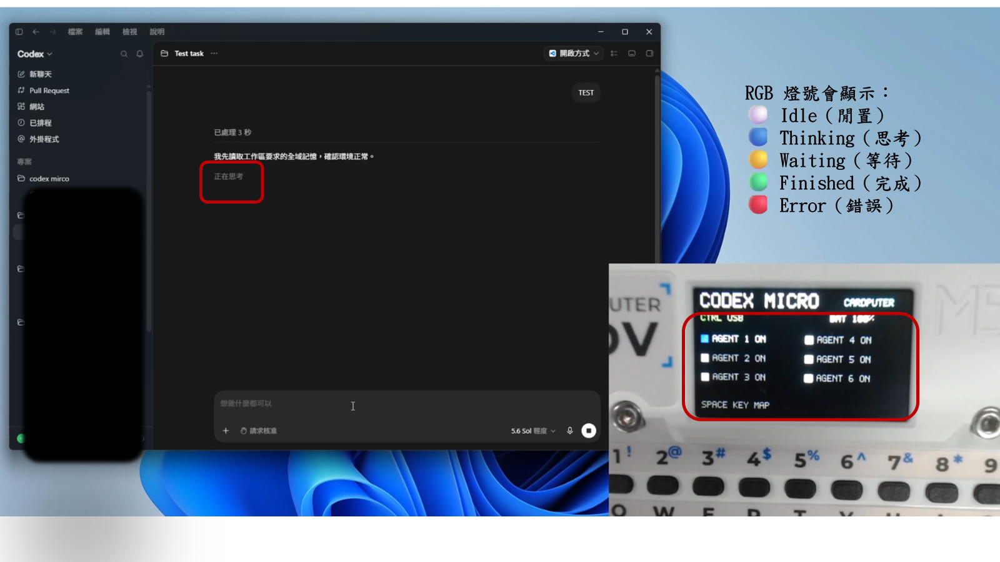
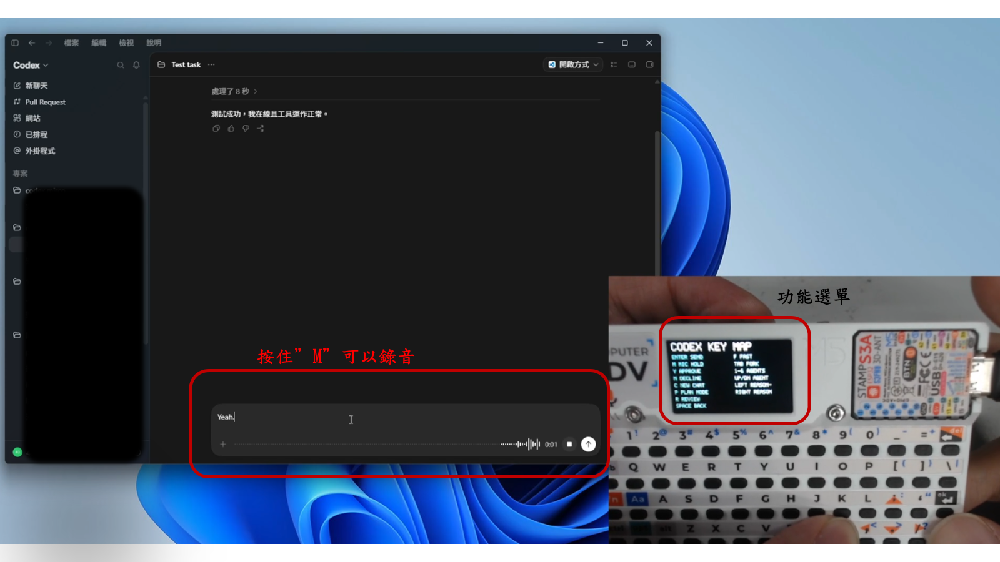
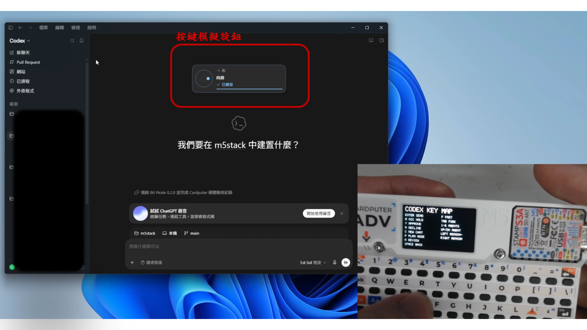

# Codex Micro (Cardputer)

[English](README.md) | 繁體中文

將 **M5Stack Cardputer ADV** 變成 Windows 11 的 Codex 控制器與 USB
麥克風。可使用 USB 或 BLE 傳送 Codex 按鍵；USB 連接時也能使用 Cardputer
內建麥克風，不需要安裝自訂驅動程式。

> 僅支援 Cardputer **ADV（StampS3A／ESP32-S3）**，不支援原版 Cardputer。

## 功能

- USB：Codex 按鍵控制＋Cardputer ADV 內建麥克風。
- BLE：Codex 按鍵控制，USB 無法使用時自動備援。
- LCD：連線方式、Agent 1～6 狀態、按鍵說明與平滑化電池百分比。
- 麥克風格式：單聲道、16 kHz、16-bit PCM。
- 不包含 speaker、錄音儲存、Wi-Fi 或音訊播放。

## 畫面預覽

| 主頁 | 操作說明 |
| :---: | :---: |
|  |  |

## 實際操作示範

| 1. Windows 11 連線 | 2. Agent RGB 狀態 |
| :---: | :---: |
|  |  |
| 3. 麥克風與功能選單 | 4. 方向鍵控制回饋 |
|  |  |

1. Cardputer 透過 USB 或 BLE 連接 Windows 11 後，Codex 會將它辨識為
   Codex Micro 控制器。
2. LCD 的 Agent 色塊會顯示 Codex 主機傳來的狀態顏色，例如閒置、思考、
   等待、完成或錯誤。
3. 按住 `M` 可控制 Codex 語音輸入；按 `Space` 可查看 Cardputer LCD 的完整
   按鍵功能頁。
4. 按下已配置的方向鍵時，Codex 會顯示對應的 Codex Micro 類比方向回饋；
   本韌體將左右方向配置為降低／提高 reasoning 強度。

## 使用前準備

- M5Stack Cardputer ADV（StampS3A／ESP32-S3）。
- 一條可傳輸資料的 USB-C 線。
- Windows 11 電腦與 Codex 桌面版。
- 編譯與燒錄時需要 ESP-IDF v5.5.2、Git，以及可用的網路連線。
- 如需無線控制，Windows 必須支援 Bluetooth Low Energy。

## 從 GitHub 下載並燒錄（Windows 11）

### 1. 安裝 ESP-IDF 5.5.2

使用 Espressif 官方的
[Windows 安裝說明](https://docs.espressif.com/projects/esp-idf/en/v5.5.2/esp32/get-started/index.html)，
安裝 **ESP-IDF v5.5.2**。安裝完成後，從開始選單開啟
`ESP-IDF 5.5 PowerShell`。

如果開始選單沒有這個捷徑，也可以開啟一般 PowerShell，先載入 ESP-IDF：

```powershell
& "$HOME\esp\v5.5.2\esp-idf\export.ps1"
```

若 ESP-IDF 安裝在其他位置，請將路徑換成實際的 `export.ps1`。看到
`Done! You can now compile ESP-IDF projects.` 就代表環境已載入。

### 2. 下載專案

在 ESP-IDF PowerShell 執行：

```powershell
git clone https://github.com/zhao45/codex-micro-cardputer.git
cd codex-micro-cardputer
```

不使用 Git 也可以從 GitHub 點選 **Code → Download ZIP**，解壓縮後進入：

```powershell
cd "$HOME\Downloads\codex-micro-cardputer-main"
```

如果解壓縮位置不同，請改成實際資料夾路徑。

### 3. 編譯

```powershell
idf.py build
```

第一次編譯需要網路下載 ESP-IDF dependencies，完成後會產生：

```text
build/codex_micro_cardputer.bin
```

### 4. 讓 Cardputer 進入下載模式

1. 使用可傳輸資料的 USB 線連接 Cardputer ADV。
2. 按住 `G0`，再按一下 Reset；也可以按住 `G0` 時重新插入 USB。
3. Windows 出現新的 COM 後放開 `G0`。
4. 執行下列指令找出連接埠：

```powershell
Get-CimInstance Win32_SerialPort |
  Select-Object DeviceID,Name,PNPDeviceID
```

請找名稱類似 `USB Serial Device (COM9)` 的裝置。每台電腦的 COM 編號可能
不同。

### 5. 燒錄

將 `COM9` 換成剛才查到的連接埠：

```powershell
idf.py -p COM9 flash
```

看到 `Hash of data verified` 與 `Hard resetting via RTS pin` 表示燒錄成功。
燒錄後請放開 `G0`，按一下 Reset；若仍停在下載模式，拔掉 USB 後在**不按
G0** 的情況下重新插入。

韌體正常啟動後，燒錄用的 COM 可能消失，因為 USB 已切換成 Codex HID＋
麥克風複合裝置，這是正常現象。

## 連線與使用

| BLE | USB | 可用功能 |
|---|---|---|
| 有 | 有 | USB Codex 按鍵＋Cardputer 麥克風；BLE 備援 |
| 有 | 無 | BLE Codex 按鍵；使用 Windows／Codex 選擇的麥克風 |
| 無 | 有 | USB Codex 按鍵＋Cardputer 麥克風 |
| 無 | 無 | LCD 本機頁面與電池顯示 |

使用 BLE 時，在 Windows「設定 → 藍牙與裝置」配對 `Codex Micro`。使用內建
麥克風時，到「設定 → 系統 → 音效 → 輸入」選擇
`Cardputer ADV Microphone`。

USB 與 BLE 同時存在時會優先使用 USB；若 Codex 沒有接受 USB HID，BLE
仍會保持可用。同一個按鍵不會同時從 USB 與 BLE 重複送出。

## 完整按鍵功能

| Cardputer 按鍵 | 動作 | 功能說明 | 需要自訂設定 |
|---|---|---|---|
| `Enter` | Send | 送出目前在 Codex 輸入框中的訊息或指令 | 否 |
| `M`（按住） | Microphone press | 開始使用語音輸入；按住時持續啟用麥克風控制 | 否 |
| `M`（放開） | Microphone release | 結束語音輸入；Cardputer 韌體也會停止傳送麥克風按鍵狀態 | 否 |
| `Y` | Approve | Codex 要求執行指令或修改權限時，核准目前的要求 | 否 |
| `N` | Decline | 拒絕目前的權限或確認要求 | 否 |
| `F` | Fast | 觸發 Codex Micro 的 Fast 動作 | 否 |
| `Tab` | Fork | 從目前工作建立分支／Fork | 否 |
| `1` | Agent 1 | 直接切換到第 1 個 Agent／工作槽位 | 否 |
| `2` | Agent 2 | 直接切換到第 2 個 Agent／工作槽位 | 否 |
| `3` | Agent 3 | 直接切換到第 3 個 Agent／工作槽位 | 否 |
| `4` | Agent 4 | 直接切換到第 4 個 Agent／工作槽位 | 否 |
| `5` | Agent 5 | 直接切換到第 5 個 Agent／工作槽位 | 否 |
| `6` | Agent 6 | 直接切換到第 6 個 Agent／工作槽位 | 否 |
| `↑` | Previous Agent | 切換到上一個 Agent；Agent 1 再往上會回到 Agent 6 | 否 |
| `↓` | Next Agent | 切換到下一個 Agent；Agent 6 再往下會回到 Agent 1 | 否 |
| `C` | New Thread／New Chat | 直接建立新的 Codex 工作 | 是 |
| `P` | Plan Mode | 開啟或關閉 Plan Mode，先規劃再執行修改 | 是 |
| `R` | Review Changes | 開啟目前程式碼修改／diff 的審查畫面 | 是 |
| `←` | Reasoning − | 將目前模型的 reasoning 強度降低一級 | 是 |
| `→` | Reasoning ＋ | 將目前模型的 reasoning 強度提高一級 | 是 |
| `Space` | LCD page | 在狀態主頁和按鍵說明頁之間切換；不會傳送到電腦 | 否 |

表格以外的按鍵（例如字母 `A`、`B`、`D`、`E`、`G` 等）目前沒有配置
Codex 動作，按下時不會送出一般鍵盤文字，也不會影響電腦。

### 首次設定新增按鍵

Codex 桌面版允許自訂 Codex Micro 的 Command Keys 與 Analog Stick 方向。
開啟 **Settings → Codex Micro**，依照下表設定一次：

| Codex Micro 設定位置 | 指定動作 | Cardputer 對應鍵 |
|---|---|---|
| Analog Up | Toggle Plan Mode | P |
| Analog Down | New Thread／New Chat | C |
| Analog Left | Decrease Reasoning Effort | ← |
| Analog Right | Increase Reasoning Effort | → |
| 第二個麥克風鍵（ACT11） | Review Changes | R |

上表標示「需要自訂設定」的五個按鍵，必須完成以下對應才會執行預期動作。
設定 ACT11 前，先在同一頁啟用 **Use separate microphone keys**。第一個麥克風
鍵仍保留 Microphone 動作，供 Cardputer 的 `M` 使用；第二個設為 Review
Changes。↑／↓ 與數字鍵由韌體直接選 Agent，不需要在 Codex 設定。

P 對應的 Analog Up 是 Codex Micro 預設 Plan Mode，但仍建議核對其餘四項，
避免舊的個人設定造成動作不同。官方設定說明請見
[Codex Micro 文件](https://learn.chatgpt.com/docs/features/codex-micro)。

### 功能驗收

完成設定後可以依序檢查：

1. USB 連接、關閉藍牙時，Enter、Y、N、C、P、R 仍能控制 Codex。
2. 按 ↑／↓ 時，LCD 選取框會依序在 Agent 1～6 循環，不會隨機跳動。
3. 按 ←／→ 時，Codex 的 reasoning 強度會降低／提高。
4. Windows「設定 → 系統 → 音效 → 輸入」可看到並選擇
   `Cardputer ADV Microphone`。
5. 拔除 USB 後，已配對 BLE 時仍可使用 Codex 按鍵控制。

## 常見問題

### 找不到 COM

- 確認使用的是 USB 資料線，不是只能充電的線。
- 重新執行「按住 G0 → Reset／插入 USB」。
- 到 Windows 裝置管理員查看「連接埠（COM 和 LPT）」。

### 顯示 `Access denied` 或 COM 被占用

關閉其他 serial monitor、ESP-IDF monitor 或使用該 COM 的程式後再燒錄。

### 燒錄成功但畫面沒亮

裝置通常仍停在 G0 download mode。放開 `G0`，按 Reset，或不按 G0 重新插入
USB。

### Windows 找不到麥克風

重新插拔 USB，然後檢查「設定 → 系統 → 音效 → 輸入」。也可以執行：

```powershell
Get-PnpDevice -PresentOnly -Class AudioEndpoint |
  Where-Object FriendlyName -match 'Cardputer'
```

Windows／Codex 仍負責選擇實際使用的音訊輸入；韌體無法強制桌面程式切換
麥克風。

## 授權與來源

本專案是非官方相容性專案，與 OpenAI、Work Louder 或 M5Stack 無隸屬關係。
部分底層模組源自 MIT 授權的
[shenjingnan/agentmote](https://github.com/shenjingnan/agentmote)；USB Audio
元件源自 Espressif `esp-iot-solution` 並使用 Apache License 2.0。詳情請參閱
[LICENSE](LICENSE)、[NOTICE.md](NOTICE.md) 與元件內附的授權檔。
